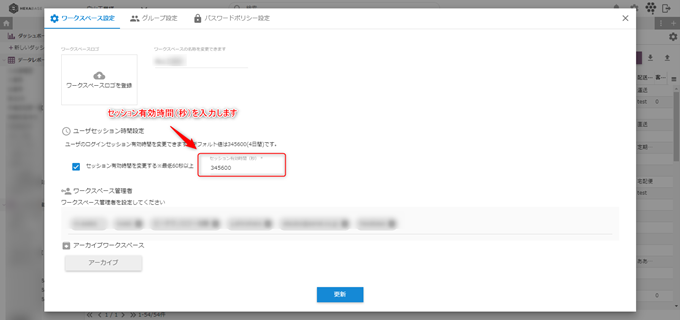
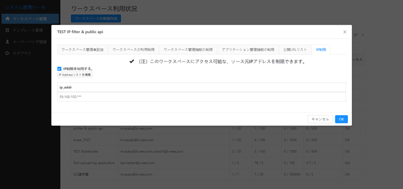
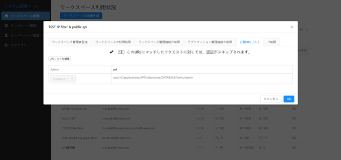

# Hexabase update : 2020.10 -2019.11

## 主な変更点 Major Changes

### ユーザーの登録アドレス更新 API を追加した

Added a API of user registration address update.

説明：アカウントのメールアドレスは初回登録時のまま変更できなかったため、メールアドレスを変更するための API を追加しました。

```
　POST /api/v0/users/email
　payload
{
    "email": "xxxx", // Required
    "registration_path": "xxxx"  "メールアドレス変更したユーザーを確認するためのパス" // options (default: 'confirm_update_email')
}
```

### ログインセッション有効時間の設定を追加

Add settings for login session validity time.

説明：ログインセッションの有効時間をワークスペース毎に秒単位（最低 60 秒以上）で設定できるよう、ワークスペース設定に機能を追加しました。



### adminTool に IP フィルター及び公開 URL リストを追加

Added IP filters and public URL list to the adminTool.

説明：

1. IP フィルター：特定ワークスペースに対し、利用できるソース元 IP アドレスを制限することで、よりセキュリティレベルの高い顧客への対応を可能としました。



2. 公開 URL リスト：公開を想定しているデータがある場合など、公開 URL リストに特定の URL を設定することで、Hexabase にアカウント登録していないユーザーでも Hexabase のデータベース上の情報を取得できる機能を追加しました。



## その他の変更点 Other Changes

### 2020.11.05

#### Title : データレポートのデータがない場合に空行を表示できない

- Label : bug
- Version : v0.24.0
- Category : データ表示
- Pull request : 789 (apicore)

#### Title : アクションスクリプトの実行時に時間かかる

- Label : bug
- Version : v0.24.0
- Category : 基本操作
- Pull request : 788 (apicore)

#### Title : データレポートの取得 API に totalItems を追加

- Label : enhancement
- Version : v0.24.0
- Category : データ表示
- Pull request : 786 (apicore)

#### Title : ワークスペース毎に送信するメールのテンプレートを変更できるようにする

- Label : new feature
- Version : v0.24.0
- Category : 基本操作
- Pull request : 785 (apicore)

#### Title : group 取得時の API の不具合修正

- Label : bug
- Version : v0.24.0
- Category : 基本操作
- Pull request : 780 (apicore)

#### Title : データレポートの取得 API にページ選択と複数ソート機能を追加

- Label : enhancement
- Version : v0.24.0
- Category : データ表示
- Pull request : 779 (apicore)

#### Title : メールアドレス変更の確認画面で変更後のメールアドレスが表示されないバグを修正

- Label : bug
- Version : v0.24.0
- Category : 基本操作
- Pull request : 766 (apicore)

#### Title : アイテム更新の場合、トークンの寿命が延長されない

- Label : bug
- Version : v0.24.0
- Category : 基本操作
- Pull request : 764 (apicore)

#### Title : ユーザーの登録アドレス更新 API の追加

- Label : enhancement
- Version : v0.24.0
- Category : 基本操作
- Pull request : 746 (apicore)

#### Title : データレポートのアイテムリンクの重複を修正

- Label : bug
- Version : v0.24.0
- Category : 基本操作
- Pull request : 742 (apicore)

#### Title : user 関連 API のキャッシュが残ってしまう

- Label : bug
- Version : v0.24.0
- Category : 基本操作
- Pull request : 728 (apicore)

#### Title : データレポートの取得結果に created_at、updated_at を追加

- Label : enhancement
- Version : v0.24.0
- Category : 基本操作
- Pull request : 725 (apicore)

#### Title : テンプレート復元の際にデータレポートの選択肢やチェックボックス型の検索条件の設定が保存されない問題の修正

- Label : bug
- Version : v0.24.0
- Category : 基本操作
- Pull request : 716 (apicore)

#### Title : use_display_id が設定されている場合にオプションの displayID に応答するように変更

- Label : enhancement
- Version : v0.24.0
- Category : 基本操作
- Pull request : 715 (apicore)

#### Title : インポーターからチェックボックス型に CSV をインポートできない

- Label : bug
- Version : v0.24.0
- Category : CSV インポート
- Pull request : 713 (apicore)

#### Title : オプションとステータスに display_id を追加

- Label : enhancement
- Version : v0.24.0
- Category : データ表示
- Pull request : 700 (apicore)

#### Title : データレポートとダッシュボードの display_id を復元できない

- Label : bug
- Version : v0.24.0
- Category : データ表示
- Pull request : 694 (apicore)

#### Title : API でのアイテムの作成/更新のための DataType チェック

- Label : enhancement
- Version : v0.24.0
- Category : 基本操作
- Pull request : 689 (apicore)

#### Title : ログインセッション有効時間の設定を追加

- Label : enhancement
- Version : v0.24.0
- Category : ★ 基本操作
- Pull request : 684 (apicore)

#### Title : データレポートの API による CSV ダウンロードで display_id を設定するとデータが空になる

- Label : bug
- Version : v0.24.0
- Category : 基本操作
- Pull request : 670 (apicore)

#### Title : ダッシュボードのアイテムが作成できない

- Label : bug
- Version : v0.24.0
- Category : データ表示
- Pull request : 667 (apicore)

#### Title : neo4j から arangoDB への切替え

- Label : enhancement
- Version : v0.24.0
- Category : 基本操作
- Pull request : 653 (apicore)

#### Title : プロジェクトのテンプレート復元時に display_id 及び ActionHook の設定が復元されない

- Label : bug
- Version : v0.24.0
- Category : 基本操作
- Pull request : 650 (apicore)

#### Title : データレポートの display_id を searchConditions として使用できるようにする

- Label : enhancement
- Version : v0.24.0
- Category : データ表示
- Pull request : 645 (apicore)

#### Title : CSV インポートで display_id が使用できない

- Label : bug
- Version : v0.24.0
- Category : CSV インポート
- Pull request : 638 (apicore)

#### Title : データレポートのフィールド取得 API に display_id を追加

- Label : enhancement
- Version : v0.24.0
- Category : データ表示
- Pull request : 623 (apicore)

#### Title : get task API のオプションに category を追加

- Label : enhancement
- Version : v0.24.0
- Category : 基本操作
- Pull request : 613 (apicore)

#### Title : userinfo のレスポンスに get_user_groups を追加

- Label : enhancement
- Version : v0.24.0
- Category : 基本操作
- Pull request : 612 (apicore)

#### Title : 関連アイテムを表示する API の作成

- Label : enhancement
- Version : v0.24.0
- Category : 基本操作
- Pull request : 610 (apicore)

#### Title : ユーザーロールを取得する API を追加

- Label : enhancement
- Version : v0.24.0
- Category : 基本操作
- Pull request : 601 (apicore)

#### Title : 検索条件を取得する API に display_id を追加

- Label : enhancement
- Version : v0.24.0
- Category : 基本操作
- Pull request : 600 (apicore)

#### Title : UI とダウンロードした CSV の日付の値が異なっている

- Label : bug
- Version : v0.24.0
- Category : 基本操作
- Pull request : 587 (apicore)

#### Title : 新規アイテム作成 API で display_id を使用できるようにする

- Label : enhancement
- Version : v0.24.0
- Category : 基本操作
- Pull request : 581 (apicore)

#### Title : 実行中の queue タスクのステータスを取得する API の追加

- Label : enhancement
- Version : v0.24.0
- Category : 基本操作
- Pull request : 579 (apicore)

#### Title : グループからユーザーを削除した際にユーザーのロールが消えてしまう

- Label : bug
- Version : v0.24.0
- Category : 基本操作
- Pull request : 571 (apicore)

#### Title : ワークスペースのデータ使用量(GetWorkspaceUsage)を取得する API の追加

- Label : enhancement
- Version : v0.24.0
- Category : 基本操作
- Pull request : 568 (apicore)

#### Title : ユーザ初期登録時の追加情報が mongoDB に保存されない

- Label : bug
- Version : v0.24.0
- Category : 基本操作
- Pull request : 557 (apicore)

#### Title : "データレポートの取得 API のレスポンスに d_id

- Label : enhancement
- Version : v0.24.0
- Category : 基本操作
- Pull request : i_id を追加する"

#### Title : queue_items ステータスを取得するための API を追加

- Label : enhancement
- Version : v0.24.0
- Category : 基本操作
- Pull request : 555 (apicore)

#### Title : ユーザーの追加情報更新 API を追加

- Label : enhancement
- Version : v0.24.0
- Category : 基本操作
- Pull request : 533 (apicore)

#### Title : ActionHook 機能の追加

- Label : new feature
- Version : v0.24.0
- Category : 基本操作
- Pull request : 521 (apicore)

#### Title : GetItemPost に displayID を使用する

- Label : enhancement
- Version : v0.24.0
- Category : 基本操作
- Pull request : 519 (apicore)

#### Title : アクションの display_id の不具合

- Label : bug
- Version : v0.24.0
- Category : 基本操作
- Pull request : 516 (apicore)

#### Title : display_id をプロジェクトテンプレートに保存し、復元できるようにする

- Label : enhancement
- Version : v0.24.0
- Category : 基本操作
- Pull request : 515 (apicore)

#### Title : グループロール API とユーザーロール API を追加

- Label : enhancement
- Version : v0.24.0
- Category : 基本操作
- Pull request : 511 (apicore)

#### Title : グリッドビューをデフォルトビューとして使用できるようにするオプションを追加

- Label : enhancement
- Version : v0.24.0
- Category : 基本操作
- Pull request : 497 (apicore)

#### Title : グループとユーザーの API を追加

- Label : enhancement
- Version : v0.24.0
- Category : 基本操作
- Pull request : 494 (apicore)

#### Title : スーパーバイザーの重複

- Label : bug
- Version : v0.24.0
- Category : 基本操作
- Pull request : 483 (apicore)

#### Title : updatelink の API を追加

- Label : enhancement
- Version : v0.24.0
- Category : 基本操作
- Pull request : 480 (apicore)

#### Title : DataReport および DashboardItem（Chart）用の API を追加

- Label : enhancement
- Version : v0.24.0
- Category : 基本操作
- Pull request : 479 (apicore)

#### Title : 検索条件に初期設定を追加

- Label : enhancement
- Version : v0.24.0
- Category : データ表示
- Pull request : 476 (apicore)

#### Title : joblinker の処理完了後に通知を行う

- Label : enhancement
- Version : v0.24.0
- Category : 基本操作
- Pull request : 25 (joblinker)

#### Title : チェックボックスタイプのフィールドがインポートできない

- Label : bug
- Version : v0.24.0
- Category : CSV インポート
- Pull request : 206 (importer)

#### Title : インポート時の処理が完了した場合に通知する

- Label : enhancement
- Version : v0.24.0
- Category : CSV インポート
- Pull request : 163 (importer)

#### Title : インポート時の処理が失敗した場合に通知する

- Label : enhancement
- Version : v0.24.0
- Category : CSV インポート
- Pull request : 172 (importer)

#### Title : adminTool に IP フィルター及び公開 URL リストを追加

- Label : enhancement
- Version : v0.24.0
- Category : ★ 基本操作
- Pull request : 30 (adminTool)

#### Title : 科目設定の処理時間改善

- Label : enhancement
- Version : v0.24.0
- Category : 基本操作
- Pull request : 104 (auditCore)

#### Title : 決算月を 12 月に設定すると会計年度が-1 される

- Label : bug
- Version : v0.24.0
- Category : 基本操作
- Pull request : 98 (auditCore)

#### Title : 予算が計算されない

- Label : bug
- Version : v0.24.0
- Category : 基本操作
- Pull request : 95 (auditCore)

#### Title : データ取得先切り替え処理

- Label : enhancement
- Version : v0.24.0
- Category : 基本操作
- Pull request : 94 (auditCore)
